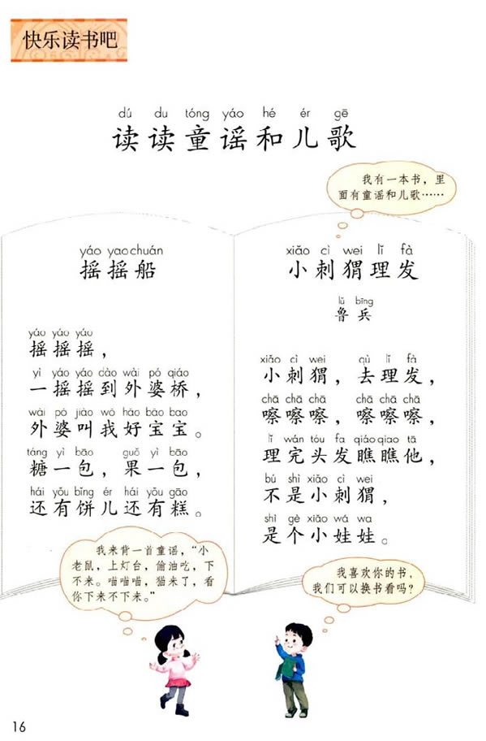

## 重读一年级
1. 课文：四季

```
草芽尖尖，
他对小鸟说：
“我是春天。”
荷叶圆圆，
他对青蛙说：
“我是夏天。”
谷穗弯弯，
他鞠着躬说：
“我是秋天。”
雪人大肚子一挺，
他顽皮地说：
“我就是冬天。
```

    这个四季让我觉得很陌生，生于南方，并没有很明显的四季之分，最的感觉是“热”和“冷”，一年四季，每季三个月看起来很“严密”的季度划分，其实并不严谨，不同地区的季节长短与体验可能完全不同，尤其像中国这么大的国家。

    我从小到大几乎没有见过荷叶，所以你和我说“荷叶圆圆”，我是完全无法想象的。夏天用“烈日炎炎”来形容可能会比较准确。

    “雪人”这种事物对处于北回归线附近的人来说，几乎就是童话故事里的东西，不如“寒风”来得现实。

2. 拔萝卜：

    课本中的内容和儿歌中唱得差不多，几个人一起拔萝卜，这是什么萝卜？能有点常识不？
    哪里有需要几个人来拔的萝卜？

3. 下册：读读童谣和儿歌


>粮一包，果一包，还有饼儿还有糕，这种外婆的形象不太好。

4. 《吃水不忘挖井人》
>我不知道为什么给一年级的小朋友讲“吃水”而不是“喝水”，就是因为要讲一讲毛主席吗？

5. 《我多想去看看》
>想去看的是什么地方呢？北京城、天安门、新疆，为什么“我”会想去看看？去看这些地方对一年级的小朋友来说有必要吗？

6. 《小公鸡和小鸭子》
>小公鸡抓虫子给小鸭子吃？能有点常识么？公鸡弟弟、鸭子哥哥？谁告诉你公鸡比较小的？谁又选择你它们都是雄性的？
>这种有违常识的课文，我觉得应该删除，要教那些字完全可以通过常识的内容来讲授。

---完---
